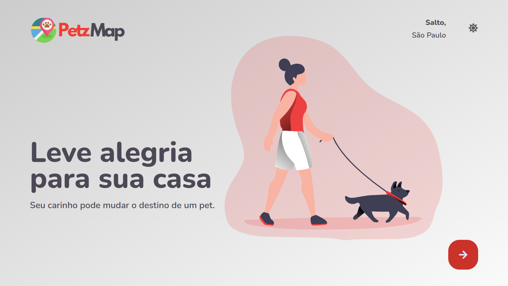
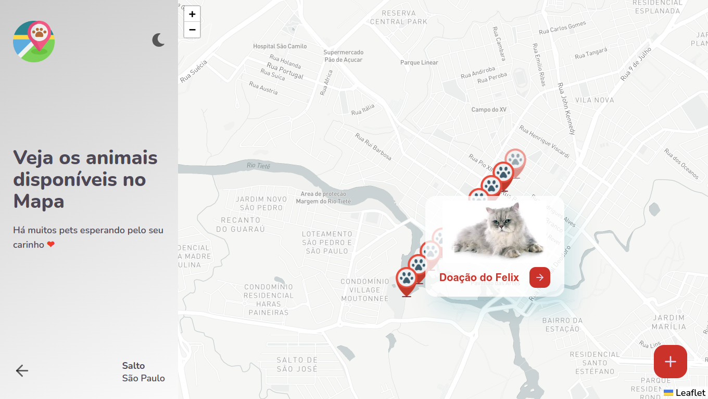
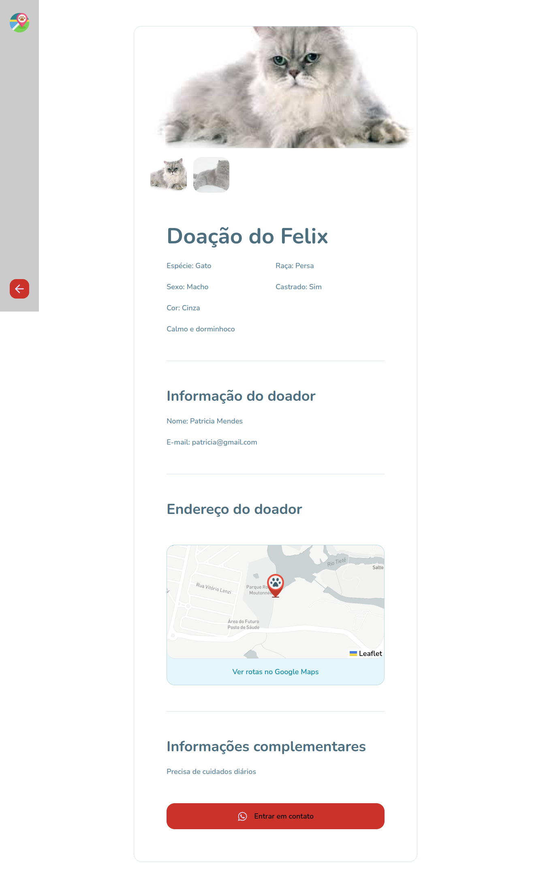
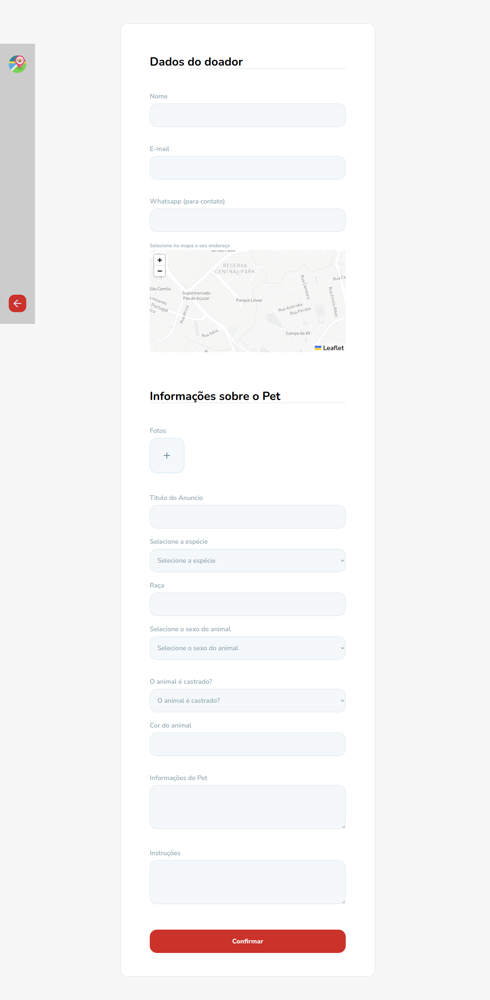
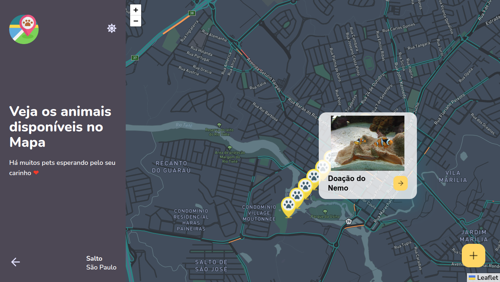
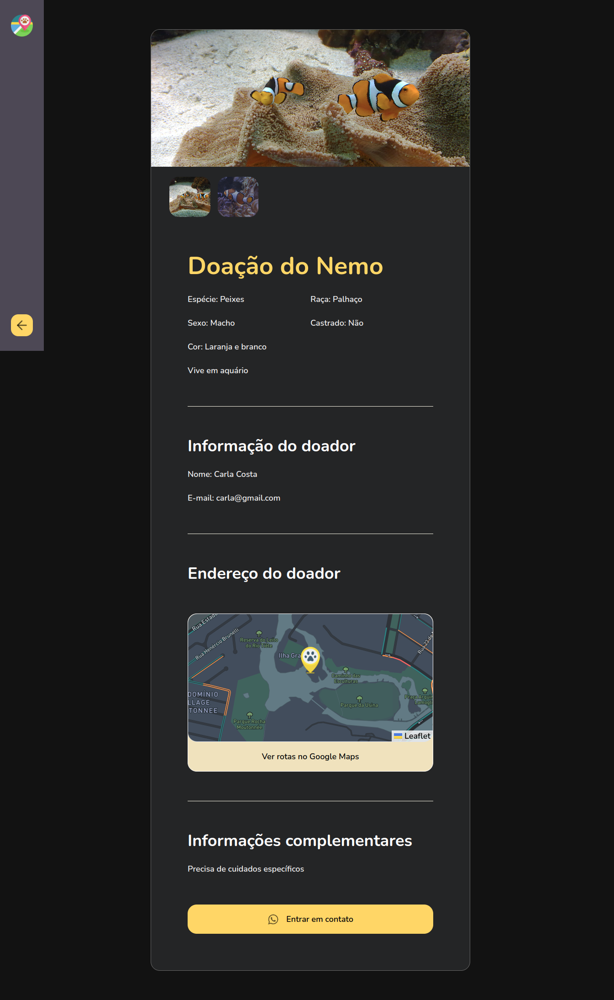
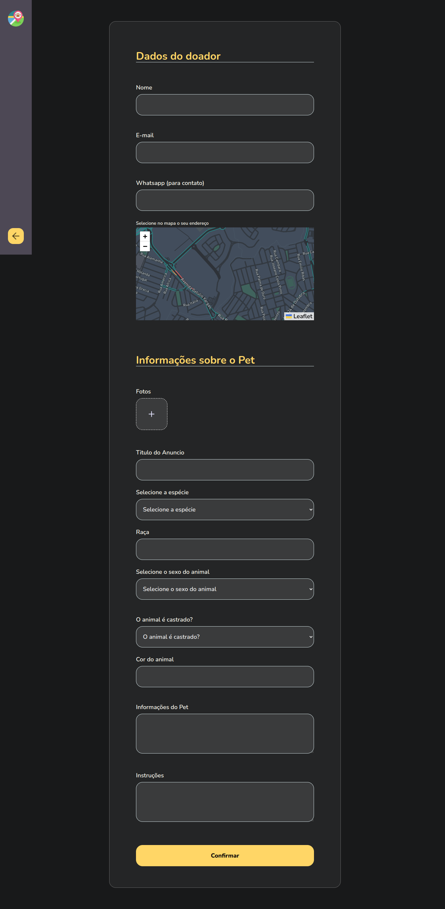

<h1 align="center">
    
</h1>

---

## Tecnologias

[*] - Axios
[*] - Leaflet
[*] - Cron
[*] - React Context
[*] - TypeScript

---

### Light Mode

   
   
   
   

---

### Dark Mode

   
   
   
   

---

### Ferramentas utilizadas na aplicação:

- [Axios](https://github.com/axios/axios)
- [ReactJS](https://vitejs.dev/).

### Ferramentas utilizadas no ambiente de desenvolvimento:

- [ESLint](https://github.com/eslint/eslint) - Lint para identificar erros em tempo de desenvolvimento.
- [Prettier](https://github.com/prettier/prettier) - Padroniza e melhora a visualização do código.

---

## :memo: Licença

Feito com :purple_heart: by [Michael W.Lopes](https://github.com/michael23-lopes)

---
